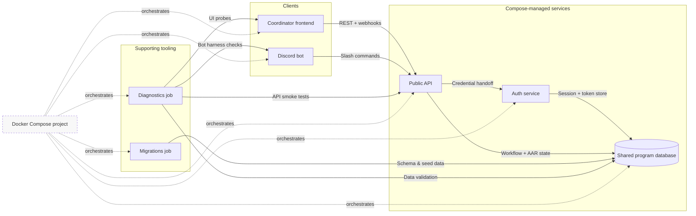

# Architecture

DevOnboarder is delivered as a Docker Compose stack that automates onboarding
workflows across Discord and the web. The public API brokers coordinator and bot
requests, hands credential checks to the auth service, and persists shared state
in the program database. Supporting tooling—Compose itself, the migrations job,
and diagnostics—keeps those services aligned and observable so coordinators can
ramp contributors without drift.

## Component map

- **Public API (`api` service):** Normalizes onboarding workflows, exposes REST
  and webhook entry points, and issues tasks to downstream automation via a
  single orchestration interface shared by the frontend and Discord bot.
- **Auth service (`auth` service):** Manages session lifecycles, token
  validation, and Discord credential exchanges before requests touch the shared
  database.
- **Discord bot (`discord-bot` service):** Runs the first-touch intake flow,
  pulls workflow templates from the API, and feeds execution signals back for
  after action reports.
- **Frontend (`frontend` service):** Gives coordinators visibility into
  onboarding state, audit trails, and diagnostics surfaced by the supporting
  tooling.
- **Shared program database (`db` service):** Persists onboarding state, Discord
  session metadata, and diagnostic checkpoints used by the automation
  guardrails.
- **Migrations job (`migrations` service):** Applies schema and seed updates
  before other services accept traffic so the platform operates against a single
  contract.
- **Diagnostics job (`diagnostics` service):** Runs smoke tests and drift checks
  that gate promotion when guardrails regress.

## Workflow summary

1. A contributor initiates onboarding through Discord; the bot relays structured
   intake data to the public API.
2. The API validates the request with the auth service, writes onboarding and
   Discord session state to the shared database, and emits updated workflow
   steps.
3. Coordinators review the same workflow data via the frontend, which reads from
   the API and surfaces diagnostics.
4. Diagnostics jobs continuously probe the API, Discord bot, and frontend while
   checking database health. Failures raise guardrail alerts inside the
   frontend, ensuring contributors remain within the automation envelope.

## Operational coupling

- **Docker Compose:** Defines the multi-container topology in `docker-compose.yml`.
  Every service, including the operational helpers, shares the same network and
  environment configuration so onboarding automation can be reproduced locally
  and in CI with `docker compose up`.
- **Migrations job:** Executed with `docker compose run --rm migrations` so
  schema changes land before services come online. This keeps the API, auth
  service, and Discord bot aligned on data contracts during onboarding events.
- **Diagnostics job:** Triggered with `docker compose run --rm diagnostics` to
  hit API endpoints, verify Discord command wiring, and sanity-check the
  frontend. Results feed the shared database and surface in the frontend so
  coordinators can catch drift before it blocks a contributor.
