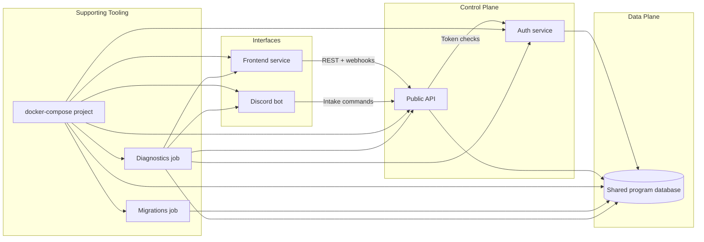

# Architecture

DevOnboarder runs as a Docker Compose project that automates onboarding
workflows across Discord and the web. The public API brokers requests from the
Discord bot and the coordinator-facing frontend, hands credential checks to the
auth service, and persists shared state in the program database. Supporting
tooling—Compose itself, the migrations container, and diagnostics jobs—keeps
those services aligned and observable while coordinators ramp contributors.

## Service responsibilities

- **Public API:** Normalizes onboarding workflows, exposes REST and webhook
  entry points, and issues tasks to downstream automation via a single
  orchestration interface.
- **Auth service:** Manages session lifecycles, token validation, and Discord
  credential exchanges before requests touch the shared database.
- **Discord bot:** Runs the first-touch intake flow, pulls workflow templates
  from the API, and feeds back execution signals that become after action
  reports.
- **Frontend:** Gives coordinators visibility into onboarding state, audit
  trails, and diagnostics surfaced by the supporting tooling.
- **Shared program database:** Persists onboarding state, Discord session
  metadata, and diagnostic checkpoints used by the automation guardrails.

## Operational coupling

- **Docker Compose:** Defines the multi-container topology in `docker-compose.yml`.
  Every service, including the operational helpers, shares the same network and
  environment configuration so onboarding automation can be reproduced locally
  and in CI with the same command: `docker compose up`.
- **Migrations job:** Runs through `docker compose run --rm migrations` so
  schema changes land before services come online, guaranteeing that the API,
  auth service, and Discord bot operate against the same data contract during
  onboarding events.
- **Diagnostics job:** Executes with `docker compose run --rm diagnostics` to
  hit API endpoints, verify Discord command wiring, and sanity-check the
  frontend. Results feed the shared database and surface in the frontend so
  coordinators can catch drift before it blocks a contributor.
